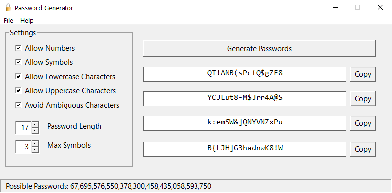
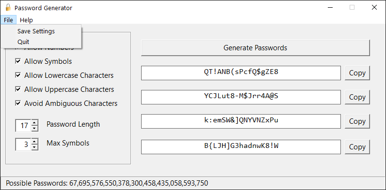
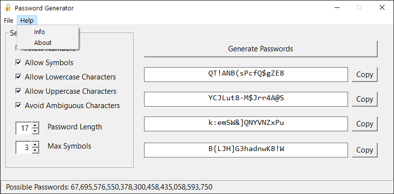
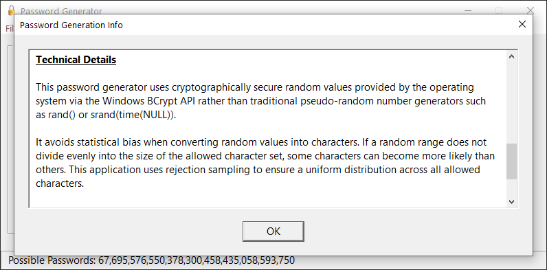
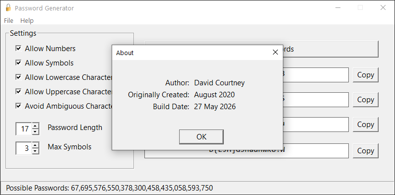

# Password Generator

Password Generator is a native Win32 desktop application for generating configurable cryptographically secure passwords. It generates four choices at a time, lets each result be copied independently, and reports the number of possible passwords for the current settings.

The project emphasizes correctness, transparency, and predictable behavior while keeping the implementation straightforward and free of unnecessary complexity.

The application is written in C against the Win32 API. Its interface is designed to make the effect of each option clear: character classes are permitted rather than required, while ambiguous-character filtering and the maximum-symbol limit intentionally reduce the available password space according to the user's preferences.

## Features

- Generates four password choices at once, with a separate **Copy** button for each result.
- Uses configurable numbers, symbols, lowercase letters, and uppercase letters.
- Optionally removes the visually ambiguous characters `0`, `1`, `I`, `O`, `i`, `l`, `o`, and `|`.
- Supports password lengths from 8 through 32 characters.
- Limits the maximum number of symbols from zero through the selected password length.
- Regenerates results as options change and detects configurations for which no password can be produced.
- Displays the exact size of the current password space in the status bar.
- Saves the current options to JSON and restores them the next time the application starts from the same working directory.
- Copies passwords to the Windows clipboard as Unicode text.

## Why this generator?

The generator obtains random bytes from the Windows cryptographic RNG by calling `BCryptGenRandom` with `BCRYPT_USE_SYSTEM_PREFERRED_RNG`. It maps those bytes to characters using rejection sampling, avoiding the modulo bias that can occur in simpler implementations based on a direct remainder operation.

A random byte has 256 possible values, while the size of the allowed character pool will not generally divide 256 evenly. The implementation calculates the largest multiple of the pool size that fits within the byte range, rejects values outside that interval, and maps only accepted values to characters. Because the accepted interval is evenly divisible by the pool size, every character in the active pool has the same probability of selection.

The completed password is shuffled with Fisher-Yates, using the same cryptographic random source and unbiased rejection-sampling approach for each swap index. Independently selecting every position from one fixed character pool already produces uniformly random passwords. The shuffle also removes positional structure that may arise when the maximum-symbol constraint changes the active pool during generation. As the application's Info page notes, constraints such as ambiguous-character filtering and a symbol cap intentionally reduce or reshape the possible output space.

## Screenshots

The main window keeps all generation controls and four results visible together. The status bar at the bottom updates the exact number of possible passwords represented by the selected options.



The **File** menu provides **Save Settings** and **Quit**. Saving writes only the generator options to `settings.json`; generated passwords are not included.



The **Help** menu opens the technical **Info** page or the **About** dialog.



The **Info** page explains how the options affect the password space and documents the use of Windows BCrypt, rejection sampling, and an unbiased Fisher-Yates shuffle.



The **About** dialog identifies the author, the original creation date, and the build date compiled into the executable.



## Building

### Requirements

| Component | Project setting |
| --- | --- |
| IDE / build tools | Visual Studio 18.x or Microsoft C++ Build Tools with the Desktop development with C++ workload |
| Platform toolset | MSVC `v145` |
| Windows SDK | Windows SDK `10.0` (`WindowsTargetPlatformVersion` is `10.0`) |
| Configurations | Debug and Release for Win32 (x86) and x64 |
| Language / application type | Native C, Unicode Windows desktop application |

The project has no package-restore step. [cJSON 1.7.16](https://github.com/DaveGamble/cJSON) is included in the `cJSON` directory. The remaining dependencies are Windows components supplied by the SDK or operating system, including BCrypt (`bcrypt.lib`), Common Controls (`comctl32.lib`), and the Rich Edit control loaded from `Msftedit.dll`.

### Visual Studio

1. Open `GUI Password Generator.sln`.
2. Select a configuration and platform, such as **Release** and **x64**.
3. Choose **Build > Build Solution**.
4. For `Release|x64`, run `x64\Release\GUI Password Generator.exe`.

### Developer command line

From a Visual Studio Developer PowerShell or Developer Command Prompt:

```powershell
msbuild "GUI Password Generator.sln" /p:Configuration=Release /p:Platform=x64
```

Change `Release` to `Debug`, or `x64` to `x86`, to build another configuration exposed by the solution.

## Technical Notes

- **Random source:** Each random byte is obtained from `BCryptGenRandom` using the system-preferred Windows cryptographic RNG. A failure from BCrypt aborts password generation.
- **Uniform selection:** Rejection sampling discards byte values that would produce modulo bias before selecting from the active character pool. Fisher-Yates shuffle indices are generated in the same way.
- **Character pool:** The generator filters printable ASCII characters from code points 33 through 126 according to the four **Allow** options. Selecting a class permits it; it does not guarantee at least one character from that class.
- **Optional constraints:** Ambiguous-character filtering removes eight explicitly listed characters. **Max Symbols** restricts punctuation characters and is clamped to the current password length.
- **Invalid configurations:** Length and pool constraints are validated before generation. When no valid output exists, the four result fields show **No Possible Password** and the generation/copy controls are disabled.
- **Password-space calculation:** The status bar calculates the exact number of valid strings for the current pool, length, and symbol cap. A small decimal big-integer implementation avoids overflowing native integer types for the supported range.
- **Settings persistence:** **File > Save Settings** serializes the five Boolean options, password length, and maximum-symbol count with cJSON. `settings.json` is stored relative to the process's current working directory and is loaded at startup. Invalid or missing values fall back to built-in defaults: all character classes enabled, ambiguous characters avoided, length 17, and at most 3 symbols.
- **Clipboard behavior:** Copying a result writes it to the system clipboard as `CF_UNICODETEXT`. As with any clipboard operation, the password remains available to other clipboard-aware software until the clipboard contents are replaced.
- **Password storage:** The settings file contains configuration only, not generated passwords. The application is a generator rather than a password manager and does not provide encrypted storage.
- **Win32 implementation:** The interface is created directly with Unicode Win32 controls. Common Controls provide the spin controls, tooltips, and status bar; Rich Edit is used for the formatted Info page.

## License

No license has been specified for this project. The bundled cJSON source retains its own MIT license notice.

## Author

**David Courtney**

Originally created in August 2020.
